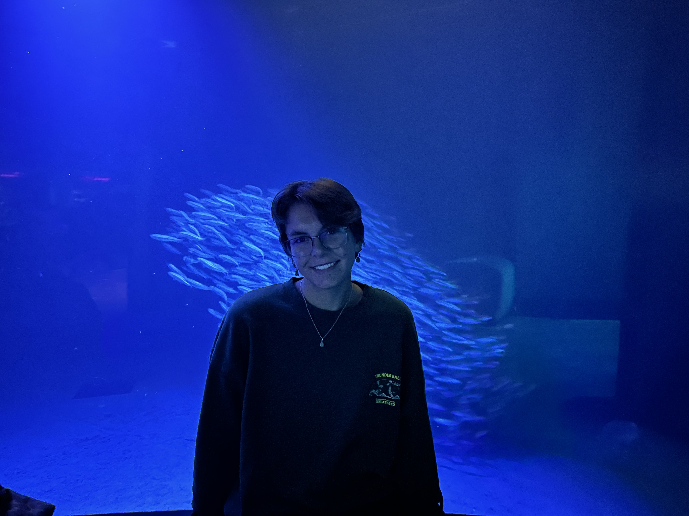

# Aquacalma

*A digital space for calm, attention, and interaction*

Aquacalma is an interactive digital environment I built as a response to how overwhelming modern digital spaces can feel. Instead of trying to grab attention, it’s meant to do the opposite; slow things down.

I was inspired by the quiet presence of fishtanks and aquariums. I’ve always found them calming and comforting, and I wanted to see how that feeling could be translated to digital form. The result is a kind of living ecosystem where fish move and react to time, motion, and user interaction. It’s responsive, but in a quiet way, creating a space that feels alive, yet gentle.

Aquacalma is structured around three modes: **Relax, Focus, and Play**.

In **Relax mode**, the environment guides your breathing. Movement and light shift slowly with your rhythm, so it feels more like something you settle into rather than control.

In **Focus mode**, the environment gradually grows the longer you are present. With sustained attention, new fish appear, movement increases, and the space becomes more visually rich.

In **Play mode**, you can freely interact; feeding fish and influencing their behavior through subtle, responsive mechanics. It’s less structured and a bit more exploratory.

At its core, Aquacalma explores how digital spaces can become restorative rather than overwhelming. The system responds to presence, so the more still and attentive you are, the more the ecosystem grows and gives back, reinforcing the idea that **stillness and attention create life**.

## Personal Statement

Aquacalma is deeply personal to me.

Growing up, aquariums and fishtanks have always been a quiet, constant presence in my life. Whether on my desk or in my room, they became a place I would return to after long or overwhelming days. Watching fish move through water created a sense of calm that I didn’t always realize I needed.

The act of feeding them forced me to slow down. It gave me a reason to pause, breathe, and be present. When I was stressed or anxious, that small interaction became grounding. When studying, their presence felt like quiet companionship, something that helped me stay focused without distraction. And when I felt restless, simply observing their movement allowed me to escape into a softer, more peaceful space.

This project is an attempt to translate that feeling into a digital form. Aquacalma is not just a simulation, but an effort to recreate a sense of calm, presence, and gentle interaction that has stayed with me for most of my life.

## **AI Use Disclosure**

I used AI tools like Cursor and ChatGPT as part of my creative process in developing Aquacalma. They were useful for testing ideas quickly and working through different approaches, especially across design and implementation. All core concepts, design direction, and final decisions were all my own. I think of AI here more as a tool, similar to any other part of the development process, rather than something that replaced authorship. I use AI not a shortcut, but a creative instrument that can extend my thinking as an artist and expand my ability to shape and realize my work in a digital space. 

## **Submission Context: SDSU Electronic Literature Competition**

Aquacalma is submitted as an interactive digital work that explores **computational poetics through system behavior rather than text alone**.

Instead of presenting traditional written narrative, the piece expresses meaning through:

- responsive interaction
- time-based environmental change
- user presence as a generative force

The work positions attention, stillness, and interaction as literary elements, where the system itself becomes the medium of expression. In this way, Aquacalma aligns with electronic literature practices that expand storytelling beyond static text into dynamic, participatory environments.

<table width="100%">
  <tr>
    <td valign="top" width="50%">

## Credits

- Ambient audio track (royalty-free): [Aquarium Fish by Magiksolo](https://pixabay.com/music/beats-aquarium-fish-132518/)

    </td>
    <td valign="top" width="50%">

## Stack

- Next.js
- React
- TypeScript
- Tailwind CSS

    </td>
  </tr>
</table>

  
   
  <i>thank you for visiting :)</i>

